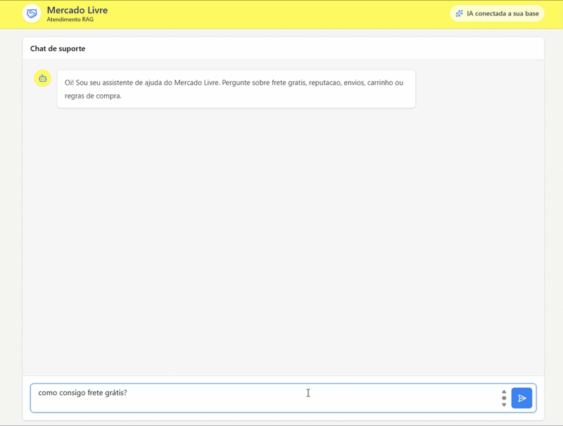
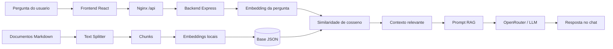

<h1 align="center">RAG Mercado Livre Unificado</h1>

<p align="center">
  Aplicacao full stack com React, Express, embeddings locais e Docker para demonstrar um fluxo de
  <strong>RAG - Retrieval-Augmented Generation</strong> sobre uma base de conhecimento inspirada no Mercado Livre.
</p>

<p align="center">
  
  
  
  
  
  
</p>

## Sobre o projeto

Este repositorio une dois projetos Front End e Back End:

- Frontend em React/Vite com uma experiencia de chat estilo IA;
- Backend em Node.js/Express responsavel por ingestao, busca semantica e chamada ao modelo de linguagem.

A aplicacao permite que o usuario faca perguntas sobre temas relacionados a regras, atendimento e operacoes inspiradas no Mercado Livre. O backend busca os trechos mais relevantes em documentos Markdown, monta um prompt com contexto recuperado e envia a pergunta para um modelo via OpenRouter.

O objetivo e estudar, de forma pratica, como uma aplicacao RAG funciona de ponta a ponta: documentos, chunks, embeddings, similaridade semantica, prompt com contexto, LLM e interface web.

## Demonstracao

<p align="center">
  
</p>

## Destaques

- Projeto full stack rodando com um unico comando via Docker Compose.
- Frontend React com historico de conversa, estados de loading e tratamento de erro.
- Backend Express com endpoint `POST /ask`.
- Pipeline de ingestao automatico ao subir o backend.
- Embeddings locais usando `@huggingface/transformers`.
- Busca por similaridade de cosseno em uma base JSON.
- Prompt orientado por contexto para reduzir respostas genericas.
- Nginx servindo o frontend e redirecionando `/api` para o backend.
- Testes unitarios no frontend e checagem de sintaxe no backend.

## Como funciona



## Arquitetura com Docker

```text
RAG_MercadoLivre_Unificado/
|-- backend/
|   |-- src/
|   |   |-- data/                       # Documentos Markdown da base de conhecimento
|   |   |-- db/                         # Chunks com embeddings gerados
|   |   |-- functions/                  # Ingestao, prompt, IA e similaridade
|   |   `-- server.js                   # API Express
|   |-- Dockerfile
|   |-- package.json
|   `-- package-lock.json
|-- frontend/
|   |-- src/
|   |   |-- api/                        # Cliente da API RAG
|   |   |-- components/                 # Componentes do chat
|   |   |-- hooks/                      # Hook de efeito de digitacao
|   |   `-- App.tsx
|   |-- Dockerfile
|   |-- nginx.conf
|   |-- package.json
|   `-- package-lock.json
|-- docker-compose.yml
|-- .env.example
`-- README.md
```

O container `frontend` publica a aplicacao em `http://localhost:8080`.

O frontend chama:

```text
/api/ask
```

O Nginx encaminha essa requisicao para:

```text
http://backend:3000/ask
```

Quando o backend sobe, ele executa automaticamente:

```bash
npm run ingest && npm start
```

Assim, os embeddings sao regenerados antes da API iniciar.

## Stack utilizada

| Camada | Tecnologias |
| --- | --- |
| Frontend | React 19, TypeScript, Vite, Tailwind CSS, Lucide React |
| Backend | Node.js, Express, dotenv |
| IA/RAG | Hugging Face Transformers, LangChain Text Splitters, OpenRouter |
| Infra | Docker, Docker Compose, Nginx |
| Testes | Vitest, Testing Library, jsdom, `node --check` |

## Base de conhecimento

Os documentos ficam em `backend/src/data` e cobrem temas como:

- anuncios;
- cancelamentos;
- devolucao;
- entrega;
- frete gratis;
- Mercado Pago;
- pagamentos;
- reputacao;
- suporte;
- vendedores.

Cada arquivo Markdown e dividido em chunks, convertido em embedding local e salvo em:

```text
backend/src/db/chunks-with-embeddings.json
```

## Variaveis de ambiente

Crie um arquivo `.env` na raiz do projeto com base no `.env.example`:

```env
OPENROUTER_API_KEY=sua_chave_aqui
OPENROUTER_MODEL=deepseek/deepseek-chat
```

| Variavel | Obrigatoria | Descricao |
| --- | --- | --- |
| `OPENROUTER_API_KEY` | Sim | Chave usada para autenticar no OpenRouter. |
| `OPENROUTER_MODEL` | Nao | Modelo usado para gerar a resposta. Padrao: `deepseek/deepseek-chat`. |

## Como rodar com Docker

Clone o repositorio:

```bash
git clone https://github.com/seu-usuario/RAG_MercadoLivre_Unificado.git
cd RAG_MercadoLivre_Unificado
```

Crie o arquivo `.env`:

```bash
cp .env.example .env
```

No PowerShell:

```powershell
Copy-Item .env.example .env
```

Preencha `OPENROUTER_API_KEY` no arquivo `.env`.

Suba a aplicacao:

```bash
docker compose up --build
```

Acesse:

```text
http://localhost:8080
```

## Comandos uteis

| Comando | Descricao |
| --- | --- |
| `docker compose up --build` | Builda e sobe frontend e backend. |
| `docker compose up -d` | Sobe os containers em segundo plano. |
| `docker compose down` | Para e remove os containers. |
| `docker compose logs -f backend` | Acompanha os logs do backend. |
| `docker compose logs -f frontend` | Acompanha os logs do frontend/Nginx. |
| `docker compose run --rm backend npm run ingest` | Executa a ingestao manualmente. |

## Endpoint principal

```http
POST /ask
```

Exemplo de payload:

```json
{
  "question": "Como funciona a devolucao de um produto?"
}
```

Exemplo de resposta:

```json
{
  "question": "Como funciona a devolucao de um produto?",
  "resp": {
    "choices": [
      {
        "message": {
          "content": "Resposta gerada pela IA..."
        }
      }
    ]
  },
  "context": "Trechos recuperados da base de conhecimento...",
  "similarity": [
    {
      "id": "devolucao.md-0",
      "source": "devolucao.md",
      "content": "Conteudo do chunk...",
      "score": 0.78
    }
  ]
}
```

## Scripts dos projetos

### Backend

| Comando | Descricao |
| --- | --- |
| `npm start` | Inicia a API Express. |
| `npm run dev` | Inicia a API com `node --watch`. |
| `npm run ingest` | Processa documentos e gera embeddings. |
| `npm test` | Executa checagem de sintaxe do servidor. |

### Frontend

| Comando | Descricao |
| --- | --- |
| `npm run dev` | Inicia o servidor de desenvolvimento Vite. |
| `npm run build` | Valida TypeScript e gera build de producao. |
| `npm run preview` | Executa uma previa local da build. |
| `npm test` | Roda os testes unitarios. |

## Testes realizados

Durante a preparacao do projeto unificado, foram validados:

- build Docker do backend;
- build Docker do frontend;
- `docker compose config`;
- subida dos containers com `docker compose up -d`;
- ingestao automatica ao iniciar o backend;
- frontend respondendo em `http://localhost:8080`;
- testes unitarios do frontend;
- checagem de sintaxe do backend.

## Aprendizados praticados

Este projeto explora conceitos importantes para aplicacoes de IA:

- como preparar uma base propria de conhecimento;
- como transformar documentos em chunks;
- como gerar embeddings locais;
- como medir similaridade entre pergunta e documentos;
- como montar prompts com contexto recuperado;
- como integrar uma LLM a uma API;
- como entregar uma experiencia de chat no frontend;
- como empacotar frontend e backend com Docker.

## Possiveis evolucoes

- Retornar no frontend as fontes usadas na resposta.
- Adicionar streaming real de tokens.
- Persistir embeddings em um banco vetorial como Chroma, Qdrant ou Pinecone.
- Melhorar validacao de entrada no endpoint `/ask`.
- Adicionar testes automatizados para similaridade e montagem de prompt.
- Criar historico persistente de conversas.
- Adicionar observabilidade e logs estruturados.

## Autor

Desenvolvido por [Lucas Metron](https://github.com/lucasmetron) como estudo pratico de RAG, IA generativa, embeddings e aplicacoes full stack com Docker.
